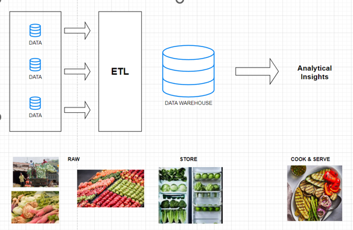

# sql-data-warehouse-project
A Data Warehouse project utilizing SQL Server, encompassing an ETL process, data modeling, and analytics.

**What is a data warehouse?**
A Data Warehouse is a subject-oriented, integrated, time-variant, and non-volatile collection of data, designed to support management decision-making processes. 

Subject-Oriented: A data warehouse organizes data around specific subjects, such as sales or customer interactions, making it easier to analyze.
Integrated: It consolidates data from different sources, ensuring consistency by resolving any conflicts in data formats or definitions.
Time-Variant: Unlike operational systems, a data warehouse stores historical data over extended periods, allowing trend analysis and time-based insights.
Non-Volatile: Once data is stored in the warehouse, it remains stable; it cannot be deleted or altered, ensuring historical accuracy and reliability.

In this project, we have a source table containing the incoming data. This data needs to be stored in a data warehouse, which will later be utilized to derive business insights. Before the data is moved to the data warehouse, it undergoes the ETL process.

ETL, which stands for Extract, Transform, and Load, is a core process in building and maintaining a data warehouse. It enables organizations to:
Extract: Retrieve data from multiple sources.
Transform: Clean, validate, and standardize the data to ensure consistency and usability.
Load: Store the transformed data into a centralized repository for efficient analysis and informed decision-making.

The above image illustrates the data transformation journey from its raw form to actionable business insights. We can compare this process to the operations of a restaurant:

- Every morning, a restaurant receives a fresh supply of vegetables, just like the incoming raw data we collect from various sources.
- These vegetables are cleaned, sorted, and stored in the refrigerator. Similarly, raw data is processed, validated, and organized during the ETL process before being stored securely in the data warehouse.
- When a customer places an order, the restaurant retrieves the required vegetables, prepares a dish, and serves it to the customer. Likewise, when insights are needed for business purposes, the stored data is retrieved, analyzed, and transformed into valuable information that supports decision-making.

# ETL Process

## Extraction in ETL
Extraction is the process of retrieving data from various sources to prepare it for transformation and loading.

**Extraction Methods**:  
- Pull Extractions  
- Push Extractions  

**Extraction Types**:  
- Full Extraction  
- Incremental Extraction  

**Extraction Techniques**:  
- Manual Data Extraction  
- Database Querying  
- File Parsing  
- API  
- Event-Based Streaming  
- CDC  
- Web Scraping  

## Transformation in ETL
Transformation involves cleaning, formatting, and converting raw data into a structured format. This step ensures the data aligns with the requirements of the target system for accurate analysis and usage.

**Transformation Methods**:  
- Data Enrichment  
- Data Normalization & Standardization  
- Data Integration  
- Business Rules & Logic  
- Derived Columns  
- Data Aggregations  

**Data Cleansing**:  
- Remove Duplicates  
- Data Filtering  
- Handling Missing Data  
- Outlier Detection  
- Datatype Casting  
- Handling Unwanted Spaces & Invalid Values  

## Load in ETL
Load is the process of transferring transformed data into a target system, such as a database or data warehouse. It ensures the data is available and ready for analysis or reporting.

**Load Processing Types**
- Batch Processing
- Stream Processing

**Load Methods**
- Full Load :
   - Truncate & Insert 
   - Upsert
   - Drop, Create, Insert
- Incremental Load :
   - Upsert
   - Append
   - Merge

**Slowly changing Dimensions**
- SCD 0 (No Historization)
- SCD 1 (Overwrite)
- SCD 2 (Insert new and make old as inactive)

# Project Plan

## Step 1: Requirement Analysis

- **Data Sources:** Utilize two primary source systems—ERP and CRM—for data collection.  
- **Data Quality:** Cleanse the data and resolve any issues to ensure accuracy and reliability.  
- **Integration:** Combine data from different sources into a unified dataset.  
- **Scope:** Focus on the latest dataset to align with project objectives.  
- **Documentation:** Provide clear documentation of the data model to support both business stakeholders and the analytics team.  

---

## Step 2: Design Data Architecture

### Types of Data Architecture

1. **Data Warehouse (Dataware):**  
   - Handles structured data.  
   - Provides a solid foundation for reporting and Business Intelligence (BI).  

2. **Data Lake:**  
   - Accommodates semi-structured and unstructured data.  
   - Supports BI and Machine Learning (ML) but requires governance to avoid becoming a "data swamp."  

3. **Data Lakehouse:**  
   - Combines features of Data Warehouse and Data Lake.  
   - Handles structured, semi-structured, and unstructured data for BI and ML with added flexibility.  

4. **Data Mesh:**  
   - Implements decentralized data architecture.  
   - Treats each domain as a separate "data product" while ensuring seamless collaboration.  

---

### Approaches for Building Data Architecture

1. **Inmon Approach:**  
   - Top-down methodology.  
   - Starts with an enterprise-wide centralized data warehouse.  

2. **Kimball Approach:**  
   - Bottom-up methodology.  
   - Focuses on creating dimensional data marts tailored to business needs.  

3. **Data Vault Approach:**  
   - Highly scalable and flexible design.  
   - Models data in "Hubs," "Links," and "Satellites" for adaptability to business changes.  

4. **Medallion Architecture:**  
   - Layered approach to organizing data.  
   - Structures data into Bronze (raw), Silver (cleaned), and Gold (business-ready) layers to streamline workflows.
  
  This project we will be building a Data Warehouse using Medallion Architecture.

  

  ## Step3: Project Intialization

## Naming Conventions
1. **Case**: Use snake_case for all names.
2. **Language**: Use English for naming.
3. **Bronze Layer Rules**: 
   - All names must start with the source system name. 
   - Table names must match their original names without renaming.
4. **Silver Layer Rules**:
   - All names must start with the source system name. 
   - Table names must match their original names without renaming.
5. **Gold Layer Rules**: 
   - All names must use meaningful, business-aligned names for tables.
   - Table names must begin with a category prefix.

## Building Bronze Layer
 
The bronze layer is the initial stage of the data pipeline where raw data is ingested and stored without any transformations or validations.

1. **Bulk Insert**:
   - Data is ingested using stored procedures to automate the process of inserting raw files (e.g., CSV, JSON) into the system.

2. **Confirmation**:
   - Basic checks are performed to ensure successful ingestion:
     - Verify that the correct files have been ingested.
     - Confirm that the expected number of rows is present.
   - No transformations or validations are applied during this step.

3. **Purpose**:
   - The bronze layer serves as a foundational stage, preserving the raw state of the data for further processing in the silver and gold layer

## Building Silver Layer (Data Transformation)
The silver layer is the next stage in the data pipeline where data from the bronze layer is transformed and cleansed to ensure consistency and usability. The focus here is on data standardization, enrichment, and the application of business rules to prepare the data for analytical and operational purposes.

1. **Data Preparation**:
   - Data from the bronze layer is ingested, and any existing data in the silver layer tables is truncated to maintain the integrity and freshness of the processed data.
   - Stored procedures are used for bulk transformations, applying rules and mappings as needed.

2. **Transformations and Business Rules**:
   - **Standardization**: Column values are standardized (e.g., trimming strings, converting case, replacing invalid values).
   - **Data Enrichment**: Business-specific mappings are applied (e.g., converting marital status codes, deriving product categories, and standardizing gender or country names).
   - **Handling Nulls and Defaults**: Missing values are replaced with meaningful defaults, and invalid entries are adjusted as per defined logic.
   - **Date Formatting**: Dates are validated and formatted to ensure consistency.
   - **Deduplication**: Duplicate records are removed to retain only the most recent entries using ranking logic (`ROW_NUMBER`).

3. **Output**:
   - The resulting tables in the silver layer contain cleansed, deduplicated, and enriched data that is ready for further aggregation and analysis in the gold layer.

4. **Purpose**:
   - The silver layer bridges raw data (bronze) and business-aligned data (gold), ensuring that processed data is both accurate and reliable.

The transformations applied in the silver tables are designed based on the relationships between the tables and their potential connections. These transformations ensure the data is structured to reflect how the tables interact, enabling seamless integration and logical links across datasets.
  

## **Data Modeling**

Data modeling refers to the process of organizing source data in a user-friendly and structured way.

### **Types of Data Models**
1. **Conceptual Data Model**:
   - Focuses on entities and their relationships.
   - Acts as a high-level "big picture" representation of the data.

2. **Logical Data Model**:
   - Includes entities, their relationships, and the columns in each entity.
   - Serves as a detailed blueprint for the database design.

3. **Physical Data Model**:
   - Provides complete details about entities and their relationships.
   - Represents the detailed implementation of the database.

### **Modeling Approach in This Project**
In this project, we are using the **Logical Data Model** to design the database.

- **Logical Data Model Usage**:
   - Typically paired with a data catalog to provide detailed column-level information for each entity.

### **Logical Data Model Types**
1. **Star Schema**:
   - A central fact table is surrounded by dimension tables, forming a star-like structure.
   - Efficient for analytical queries.

2. **Snowflake Schema**:
   - Similar to the star schema, but dimension tables are further normalized into multiple related tables.
   - This creates a snowflake-like structure, offering greater detail but potentially increasing complexity.

## Building Gold Layer

The gold layer organizes data from the silver layer into a business-oriented structure to support analytical and reporting needs. It classifies tables into **dimensions** and **facts**, integrates them based on relationships, and represents the data using a **star schema model**.

### **Key Components**
1. **Dimensions**:
   - **gold.dim_customers**:
     - Stores customer details such as personal, demographic, and geographic information.
     - Derived from `silver.crm_cust_info`, enriched with data from `silver.erp_cust_az12` and `silver.erp_loc_a101`.
   - **gold.dim_products**:
     - Contains product details, including category, sub-category, and product line.
     - Built using `silver.crm_prd_info` and `silver.erp_px_cat_g1v2`. Includes only current (non-historical) product data.

2. **Fact Table**:
   - **gold.fact_sales**:
     - Represents transactional sales data with links to product and customer dimensions.
     - Built by integrating `silver.crm_sales_details` with `gold.dim_products` and `gold.dim_customers`.

### **Purpose**
The gold layer transforms data into a meaningful business context, enabling use cases like **reporting** and **analysis** to support decision-making. By leveraging the star schema, it ensures high performance and ease of querying for analytical tasks.

